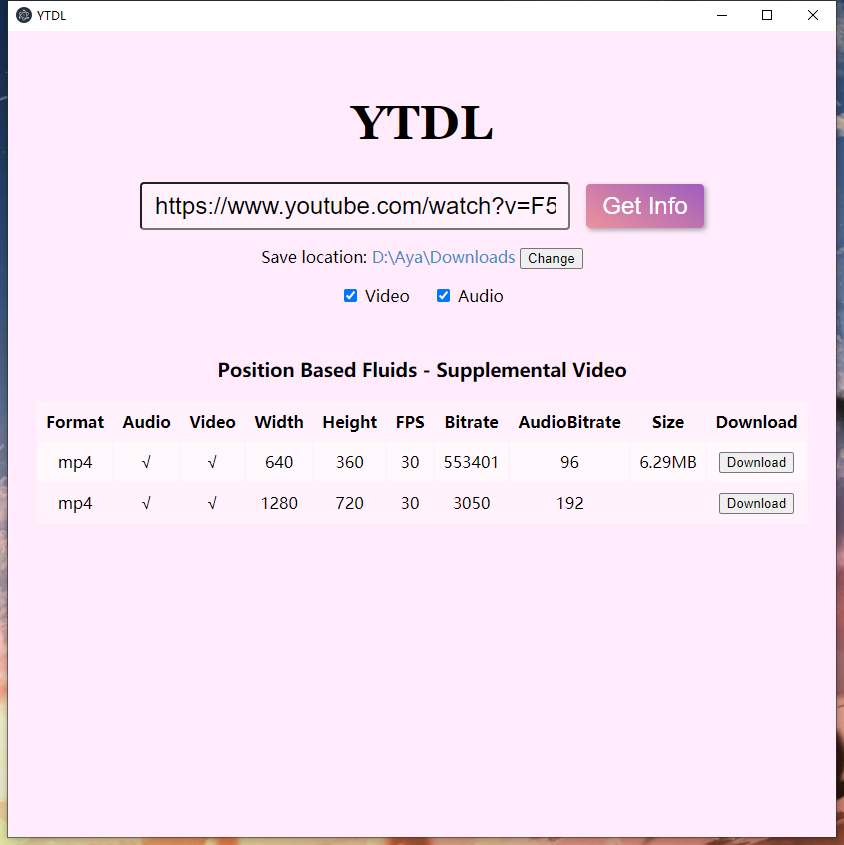
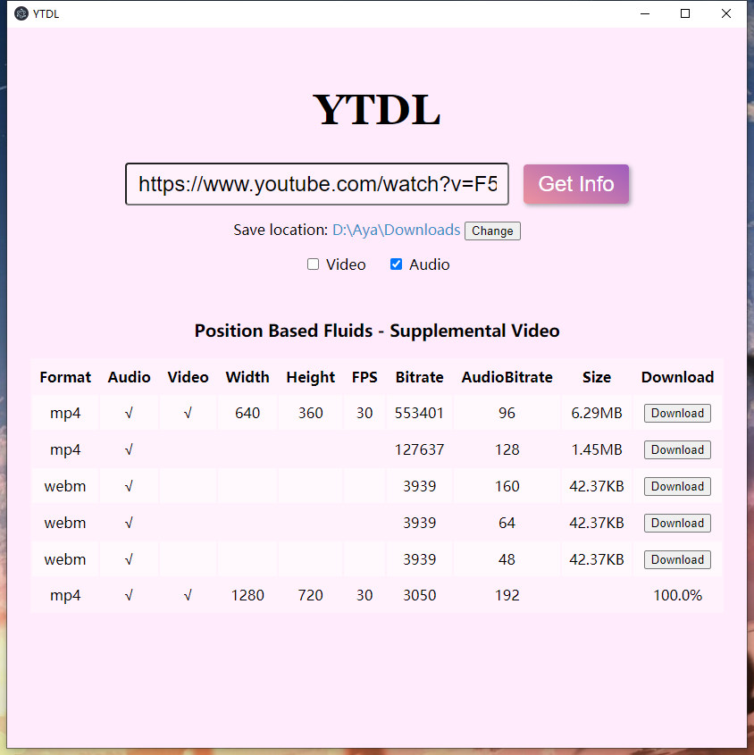

# YouTube Downloader Desktop App

Using Electron and LitHTML for UI and ytdl-core for YouTube downloading module

Simply paste in an URL and download a desired format. Uncheck video/audio checkbox to find a video/audio-only format.

### Screenshots




### Build the project

Windows installer will be provided. For other platforms,

```sh
npm i       # install dependencies
npm run make
```
